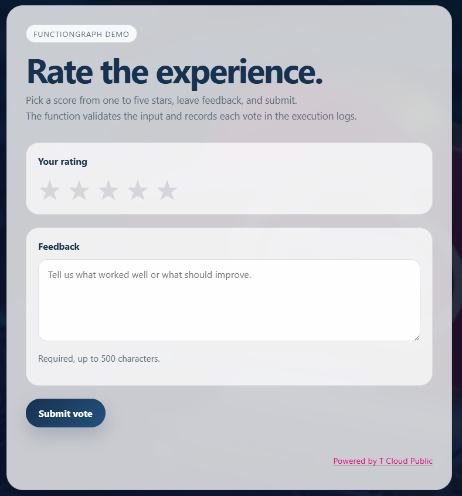
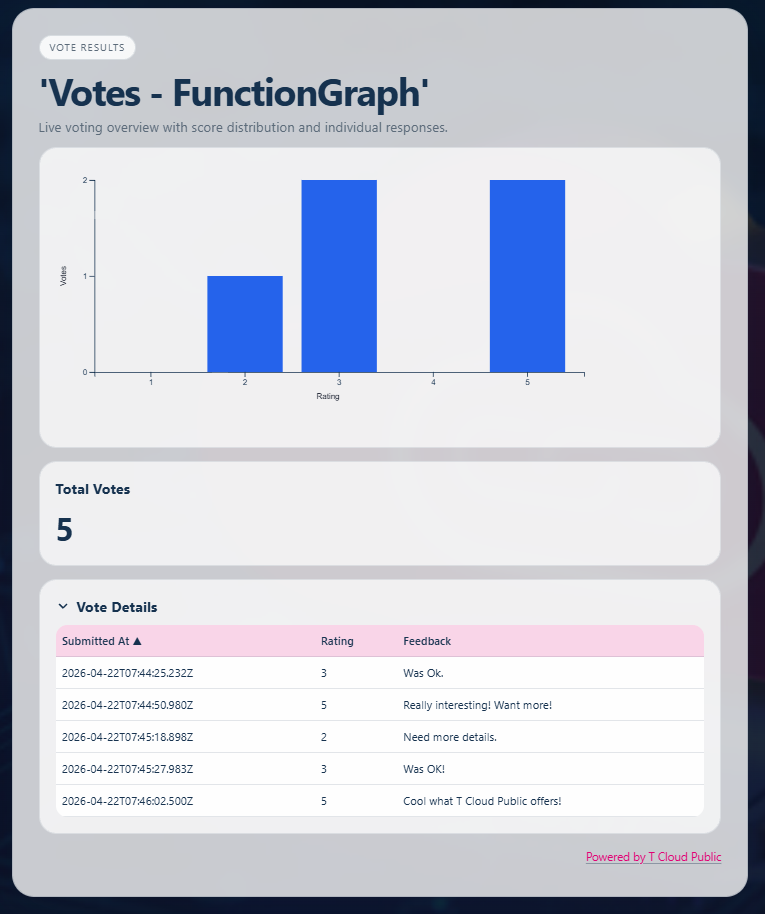

# fg-voting-app-nodejs


A simple example application demonstrating usage of FunctionGraph functions written in Node.JS on T Cloud Public.

For details on FunctionGraph functions written in Node.JS, see
[FunctionGraph Node.JS Developer Guide](https://opentelekomcloud-community.github.io/otc-functiongraph-nodejs-runtime/#).


## Overview


### backend_obs

FunctionGraph function of type Event Function responsible for persisting votes in an OBS Bucket.
Individual votes are written as OBS Objects as single json files.

For details and installation see: [backend_obs](./backend_obs/README.md)

### VoteApp

FunctionGraph function of type HTTP Function using the Node.js included HTTP module to create the HTTP server.
The function is triggered by an APIG trigger.  
It's the primary user interface for voting:





Following Endpoints are provided:

- **GET /**  
  Endpoint for delivering the UI

- **POST /vote**  
  Endpoint for capturing votes.
  It invokes backend_obs via signed requests 
  using temporary credentials retrieved from an
  agency.

- **GET /health**  
  Endpoint for monitoring.

- **GET /favicon.ico**  
  Returns favicon.  

For details and installation see: [VoteApp](./VoteApp/README.md)

### QRCode

FunctionGraph function of type Event Function triggered by an APIG trigger.
This function delivers an QR Code for opening the VoteApp.


For details and installation see: [QRCode](./QRCode/README.md)

## ShowResult

FunctionGraph function of type Event Function triggered by an APIG trigger.
This function is for data visualization and reporting.



It reads vote objects from OBS storage and normalizes 1-5 star vote counts for analytics.
The UI renders the rating as D3.js bar chart and
additionally displays a sortable details table for granular review.

For details and installation see: [ShowResult](./ShowResult/README.md)

## Prerequisites

Samples are written in Node.JS 20.15.1.

### Linux
To install in Node.JS on Linux, follow following steps:

1. Install nvm

    ```bash 
    # install curl if not available:
    sudo apt install curl
    # remove old versions of nodejs and npm
    sudo apt remove nodejs npm
    # get install scripts and install
    curl -o- https://raw.githubusercontent.com/nvm-sh/nvm/v0.40.4/install.sh | bash
    # load nvm to be present in current session
    source \~/.nvm/nvm.sh
    ```

2. Install node

    ```bash
    # install Node.JS version 20.15.1 using nvm
    nvm install 20.15.1

    # select version 20.15.1 for usage
    nvm use 20.15.1

    # check version of node
    node -v
    # check version of npm
    npm -v
    ```

3. npm pack makes use of script file `npm-scripts/postpack.sh`,
   this file must be executable:
   
   ```bash
   chmod +x npm-scripts/postpack.sh
   ```

### Windows

To install Node.JS on Windows, follow following steps:

1. Install nvm as described in [NVM Install](https://www.nvmnode.com/guide/installation.html)

2. After installation open a Command shell and execute following:

    ```cmd
    # install Node.JS version 20.15.1 using nvm
    nvm install 20.15.1

    # select version 20.15.1 for usage
    nvm use 20.15.1

    # check version of node
    node -v
    # check version of npm
    npm -v
    ```


### Proxy configurations

In case you are behind a proxy, set proxy as follows:

```bash
# set proxy for nvm
nvm proxy http://PROXY-HOST:PROXY-PORT

# set proxy for npm
npm config set proxy http://PROXY-HOST:PROXY-PORT
```

### GitHub Access

Some npm packages are hosted on GitHub packages.
To install npm packages from there, a personal access token (PAT) is necessary.
See [Installing a package](https://docs.github.com/en/packages/working-with-a-github-packages-registry/working-with-the-npm-registry#installing-a-package) on GitHub.

(in [.npmrc](./.npmrc) uncomment the line `#//npm.pkg.github.com/:_authToken=TOKEN`) by removing `#` and replace `TOKEN` with your PAT.

# Required resources on T-Cloud Public

The sample assumes that following resources are installed on T Cloud Public.

## Project: eu-de_fg-voting-app

In IAM (Identity and Access Management) console -> Projects, create a project named: **eu-de_fg-voting-app**

## API Gateway: apig-fg-voting-app

In API Gateway console, switch to project **eu-de_fg-voting-app** and click ```Create Dedicated Gateway``` with following settings:

- Region: **eu-de_fg-voting-app**
- AZ: **eu-de-01**
- Gateway-Name: **apig-fg-voting-app**
- Edition: **Basic**
- Enterprise Project: **default**
- Public Inbound Access: **Enabled: checked**
- Public Outbound Access: **Enabled: checked**
- VPC: **vpc-fg-voting-app**, **subnet-fg-voting-app**
  Create new, if it does not exist:
    - Region: **eu-de_fg-voting-app**
    - Name: **vpc-fg-voting-app**
    - IPv4 CIDR Block: **use default values**
    - Enterprise Project: **default**
    - Default Subnet:
       - Name: **subnet-fg-voting-app**
       - IPv4 CIDR Block: **use default values**

- Security Group: **default**


> Warranty Disclaimer
> -------------------
> THE OPEN SOURCE SOFTWARE IN THIS PRODUCT IS DISTRIBUTED IN THE HOPE THAT IT
> WILL BE USEFUL,BUT WITHOUT ANY WARRANTY; WITHOUT EVEN THE IMPLIED WARRANTY
> OF MERCHANTABILITY OR FITNESS FOR A PARTICULAR PURPOSE.
> 
> SEE THE APPLICABLE LICENSES FOR MORE DETAILS.
